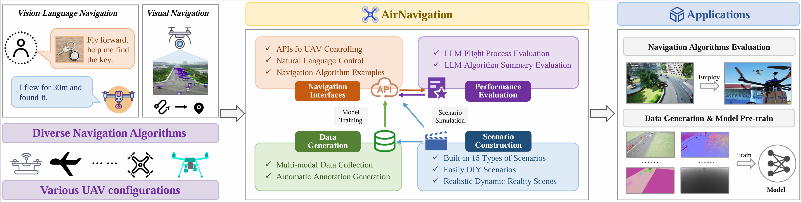

<div align="center">

## AirNavigation: An Autonomous UAV Navigation Simulation System Enhanced by Multimodal Large Language Models

[Jianyu Jiang (江建谕)](https://multimodality.group/author/%E6%B1%9F%E5%BB%BA%E8%B0%95/)* 
, &nbsp; &nbsp;
[Zequan Wang (王泽权)]() *
, &nbsp; &nbsp;
[Liang Yao (姚亮)](https://multimodality.group/author/%E5%A7%9A%E4%BA%AE/) 
, &nbsp; &nbsp;
[Fan Liu (刘凡)](https://multimodality.group/author/%E5%88%98%E5%87%A1/) ✉ 
, &nbsp; &nbsp;
[Shengxiang Xu (徐圣翔)](https://multimodality.group/author/%E5%BE%90%E5%9C%A3%E7%BF%94/) 
, &nbsp; &nbsp;
[Jun Zhou (周峻)](https://experts.griffith.edu.au/7205-jun-zhou) 
, &nbsp; &nbsp;

 &nbsp; &nbsp;  &nbsp; &nbsp; 


\* *Equal Contribution*

</div>



# video
[bilibili](https://www.bilibili.com/video/BV1b5AeeGEm2)

[youtube](https://youtube.com/watch?v=B3gYFj5jqyE)

# News

- **2025/02/11**: We construct an autonomous UAV navigation simulation system enhanced by multimodal large language models. Codes will be open-sourced at this repository.

# Getting Started

## Install

- Clone this repo:

    ```bash
    git clone https://github.com/1e12Leon/AirNavigation.git
    ```
- Create a conda virtual environment and activate it:

    ```bash
    conda create -n AirNavigation python=3.9 -y
    conda activate AirNavigation
    ```

- Install `CUDA Toolkit 11.3` ([link](https://developer.nvidia.com/cuda-11.3.0-download-archive)) and `cudnn==8.2.1` [(link)](https://developer.nvidia.com/rdp/cudnn-archive), then install `torch==1.10.1+cu113` and `torchvision==0.11.2+cu113`([link](https://pytorch.org/)):

    ```bash
    conda install torchaudio cudatoolkit=11.3 -c pytorch -y
    conda install torch-1.10.1+cu113-cp39-cp39-win_amd64.whl torchvision-0.11.2+cu113-cp39-cp39-win_amd64.whl
    # if you prefer other cuda versions, please choose suitable pytorch versions
    # see: https://pytorch.org/get-started/locally/
    ```

- Install UE4.27([link](https://www.unrealengine.com)), configure the airsim plugin([link](https://zhuanlan.zhihu.com/p/618440744)), and open the map initialization.

## Configuration

### Map Configuration

1. Configure `settings/map.json` with your map settings:
   ```json
   {
       "map": "Brushify",
       "start_map_batfile": "E:\\UAV_temp_staging\\demo_code\\python\\Shell\\Brushify.bat",
       "map_list": [
           "Brushify",
           "beach"
       ]
   }
   ```

2. Create corresponding batch files in the `Shell` directory for each map (e.g., `Brushify.bat`, `beach.bat`):
   ```batch
   @echo off
   REM Launch Unreal Engine project with map Brushify
   REM Note: Replace E:\UE4\UE_4.27\ with your Unreal Engine root directory
   REM Note: Replace E:\UAV_temp_staging\UE-project\UAV\UAV.uproject with your project path
   E:\UE4\UE_4.27\Engine\Binaries\Win64\UE4Editor.exe "E:\UAV_temp_staging\UE-project\UAV\UAV.uproject" -game -windowed -ResX=1280 -ResY=720
   ```

### Gemini API Configuration

1. Get your Gemini API key from [Google AI Studio](https://ai.google.dev/gemini-api/docs/api-key)
2. Open `config.py` and enter your API key in the designated field:
   ```python
   GEMINI_API_KEY = "your_api_key_here"
   ```

# Instructions

## Basic Controls
        
<li><b>Connect:</b> Click the 'Connect' button to establish a connection.</li>
<li><b>Take Photo:</b> Use the 'Take Photo' button to capture images.</li>
<li><b>Start Recording:</b> Click 'Start Recording' to begin video recording.</li>
<li><b>Switch Mode:</b> Use the 'Switch Mode' button to change the operation mode.</li>
<li><b>Change Weather:</b> Adjust the weather settings with the 'Change Weather' button.</li>
<li><b>Change Drone:</b> Switch between different drones using the 'Change Drone' button.</li>
<li><b>Change Map:</b> Use the 'Change Map' button to switch maps.</li>
<li><b>Record Status:</b> Click 'Record Status' to log the current state.</li>
<li><b>Export Target:</b> Use the 'Export Target' button to save object data.</li>
<li><b>Collect Dataset:</b> Click 'Collect' to start automated dataset collection.</li>

## Keyboard Control Instructions
<ul>
    <li><b>Movement:</b></li>
    <ul>
        <li><b>W, S, A, D:</b> Control forward, backward, left, and right movement.</li>
        <li><b>↑, ↓:</b> Control ascent and descent.</li>
        <li><b>←, →:</b> Control left and right rotation.</li>
        <li><b>Q, E:</b> Control camera rotation.</li>
    </ul>
    <li><b>Mode Switching:</b></li>
    <ul>
        <li><b>N:</b> Switch to 'Normal' mode.</li>
        <li><b>Y:</b> Switch to 'Target Detection' mode.</li>
        <li><b>T:</b> Switch to 'Autonomous Guidance' mode.</li>
        <li><b>B:</b> Switch to 'Target Tracking' mode.</li>
    </ul>
    <li><b>Other Functions:</b></li>
    <ul>
        <li><b>C:</b> Take a photo.</li>
        <li><b>R:</b> Record a video.</li>
        <li><b>F:</b> Log flight status.</li>
    </ul>
</ul>

## Detailed Instructions

### Change Weather

You can change the weather by clicking the 'Change Weather' button, such as "none", "rain", "snow", "dust" and "fog".

### Change Drone

You can change the drone by clicking the 'Change Drone' button, such as "Default", "Matrice200" and "sampleflyer".

### Change Map

You can change the map by clicking the 'Change Map' button, such as "Brushify", and "beach".

### Change Mode

You can change the mode by clicking the 'Change Mode' button, such as "normal", "detect", "botsort" and "track".

- normal: The default mode where you can control the drone manually.
- detect: This mode enables the system to detect and track objects in the environment.
- botsort: This mode enables the UAV to detect objects in the environment, enter the id to track the object.
- track: This mode enables the UAV to find the object and track it.

### Dataset Collection

The system includes an automated dataset collection feature that captures images and generates annotations:

1. Connect to Unreal Engine by clicking the 'Connect' button
2. Click the 'Collect' button to start dataset collection
3. The system will automatically:
   - Capture multiple types of images (Scene, Segmentation, Depth, etc.)
   - Generate XML annotations for detected objects
   - Save multi-modal data with different height and angle in organized directories:
     - Images: `data/capture_imgs/`
       - Scene images: `SceneImage/`
       - Segmentation images: `SegmentationImage/`
       - Depth images: `DepthPlanarImage/`, `DepthPerspectiveImage/`, `DepthVisImage/`
       - Surface normals: `SurfaceNormalsImage/`
       - Infrared images: `InfraredImage/`
     - Annotations: `data/Annotation/`
  


# Contact
Please Contact yaoliang@hhu.edu.cn
