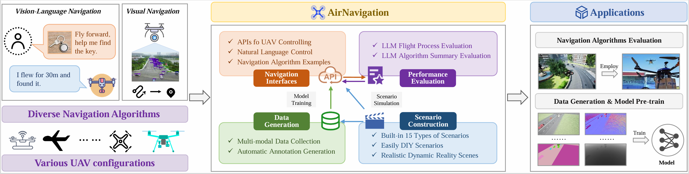

<div align="center">

## AirNavigation: An Autonomous UAV Navigation Simulation System Enhanced by Multimodal Large Language Models

[Jianyu Jiang (江建谕)](https://multimodality.group/author/%E6%B1%9F%E5%BB%BA%E8%B0%95/)* 
, &nbsp; &nbsp;
[Zequan Wang (王泽权)]() *
, &nbsp; &nbsp;
[Liang Yao (姚亮)](https://1e12leon.github.io/) 
, &nbsp; &nbsp;
[Fan Liu (刘凡)](https://multimodality.group/author/%E5%88%98%E5%87%A1/) ✉ 
, &nbsp; &nbsp;

[Shengxiang Xu (徐圣翔)](https://multimodality.group/author/%E5%BE%90%E5%9C%A3%E7%BF%94/) 
, &nbsp; &nbsp;
[Jun Zhou (周峻)](https://experts.griffith.edu.au/7205-jun-zhou) 
, &nbsp; &nbsp;

 &nbsp; &nbsp;  &nbsp; &nbsp; 


\* *Equal Contribution*

</div>



## 文档与实验

详细的 API 文档请见 [`docs`](docs/index.md)，补充实验请见 [`experiments`](experiments/)。

## 视频

- [Bilibili 视频](https://www.bilibili.com/video/BV1b5AeeGEm2)  
- [YouTube 视频](https://youtube.com/watch?v=B3gYFj5jqyE)

## 新闻

- **2025/07/22**: 添加数据集采集功能并更新文档  
- **2025/07/06**: 添加实验指标并更新配置/文档  
- **2025/03/07**: 添加中文界面白色主题  
- **2025/02/11**: 构建基于多模态大语言模型的无人机自主导航仿真系统，本仓库即将开源代码  

# 快速开始

## 系统需求

- 操作系统: Windows 10/11  
- Python 版本: 3.9  
- CUDA Toolkit: 11.3  
- Unreal Engine: 4.27  

## 安装步骤

1. 克隆本仓库：

   ```bash
   git clone https://github.com/1e12Leon/AirNavigation.git
   ```

2. 创建 Python 虚拟环境并激活：

   ```bash
   python -m venv AirNavigation
   AirNavigation\Scripts\activate
   python -m pip install --upgrade pip
   ```

3. 安装 CUDA Toolkit 11.3 和 cuDNN 8.2.1，然后安装 PyTorch 与其他依赖：

   ```bash
   pip install torch==1.10.1+cu113 torchvision==0.11.2+cu113 torchaudio==0.10.1 -f https://download.pytorch.org/whl/cu113/torch_stable.html
   pip install -r requirements.txt
   ```

4. 安装 UE4.27，配置 AirSim 插件，并初始化地图。

## 配置

### 地图配置

修改 `settings/map.json` 来配置地图：

```json
{
  "map": "default_map",
  "start_map_batfile": "absolute_path_to_your_map_batfile",
  "map_list": [
    "map1",
    "map2"
  ]
}
```

在 `Shell/` 文件夹中为每个地图创建批处理文件，例如：

```batch
@echo off
absolute_path_to_UE4\UE4Editor.exe "path_to_project\UAV.uproject" -game -windowed -ResX=1280 -ResY=720
```

### Gemini API 配置

从 Google AI Studio 获取 API key，然后写入 `config.py`：

```python
GEMINI_API_KEY = "your_api_key_here"
```

# 使用说明

## 基本操作

- 连接、拍照、录像、切换模式  
- 改变天气、切换无人机、切换地图  
- 记录状态、导出目标、采集数据集  

## 键盘控制

- 移动: W, S, A, D  
- 上下: ↑, ↓  
- 旋转: ←, →  
- 相机: Q, E  
- 模式切换: N (普通), Y (目标检测), T (自主导航), B (目标跟踪)  
- 其他: C (拍照), R (录像), F (记录状态)  

## 详细说明

支持修改天气、无人机类型、地图、工作模式，内置数据集自动采集功能。

# 联系方式

如有问题请联系: yaoliang@hhu.edu.cn