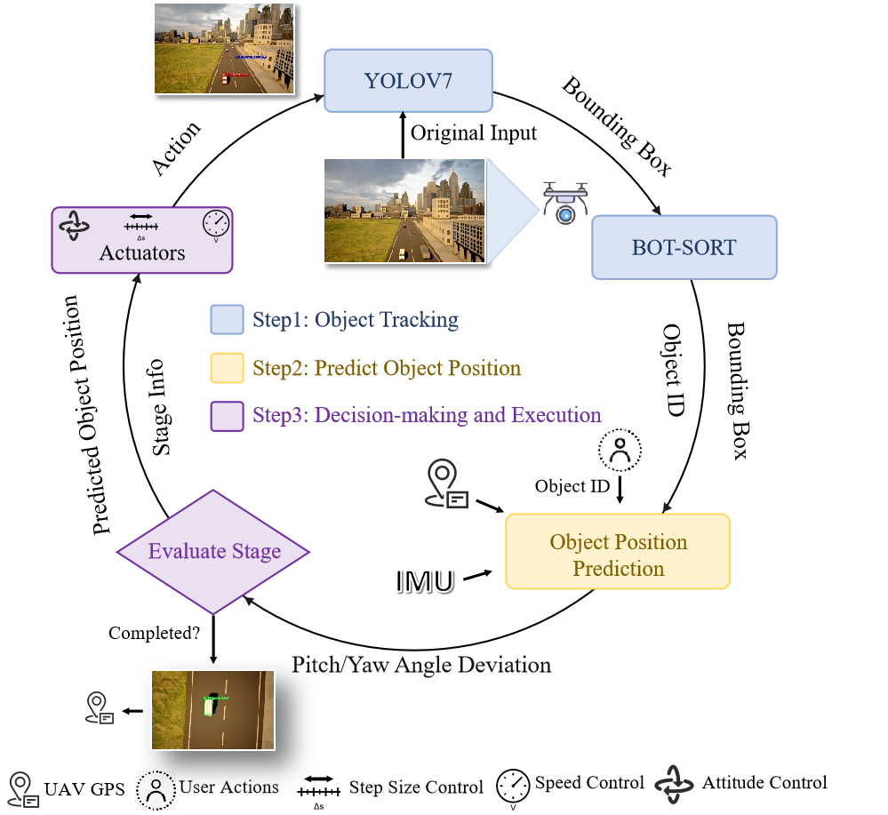

# Experiment: Algorithm Performance Evaluation

## Purpose
The purpose of this experiment is to **evaluate the stability of the system API**, to **demonstrate an algorithm evaluation demo**, and to **provide a reference for integrating new algorithms** into the AirNavigation framework.

## Algorithm: Object Tracking and Localization

The process works in three simple steps:

1. **Tracking** – YOLOv7 detects the object and BOT-SORT keeps tracking it.  
2. **Prediction** – Estimate the object’s position using camera offsets and UAV motion data.  
3. **Execution** – Adjust UAV step size, speed, and attitude until it hovers above the object a

## Results

| Model       | Scenario  | Weather | Flight Dist. (m) | Loc. Error (m) | Att. Adj. | Time (s) | Loc. Eff. (m/s) |
|-------------|-----------|---------|------------------|----------------|-----------|----------|-----------------|
| YOLOv7      | Brushify | Sunny   | 16.64            | 1.32           | 20        | 32.74    | 0.51            |
|             |           | Foggy   | 17.20            | 1.48           | 12        | 33.65    | 0.58            |
|             |           | Sunny   | 35.06            | 0.38           | 39        | 44.44    | 0.78            |
|             |           | Foggy   | 33.18            | 1.67           | 40        | 49.06    | 0.68            |
|             |           | Sunny   | 48.80            | 0.98           | 44        | 50.68    | 0.91            |
|             |           | Foggy   | 48.73            | 1.55           | 46        | 79.39    | 0.61            |
|             | Beach    | Sunny   | 15.34            | 0.59           | 19        | 10.63    | 1.44            |
|             |           | Foggy   | 15.32            | 0.84           | 8         | 25.63    | 0.59            |
|             |           | Sunny   | 39.53            | 1.37           | 27        | 52.84    | 0.74            |
|             |           | Foggy   | 39.52            | 1.27           | 44        | 58.32    | 0.67            |
|             |           | Sunny   | 47.14            | 1.15           | 46        | 60.09    | 0.78            |
|             |           | Foggy   | 47.30            | 1.17           | 30        | 113.30   | 0.42            |
| YOLOv7-Tiny | Brushify | Sunny   | 14.78            | 2.77           | 18        | 17.69    | 0.83            |
|             |           | Foggy   | 17.33            | 1.43           | 31        | 25.77    | 0.67            |
|             |           | Sunny   | 33.64            | 0.90           | 27        | 25.04    | 1.34            |
|             |           | Foggy   | 33.28            | 0.54           | 29        | 33.77    | 0.99            |
|             |           | Sunny   | 49.27            | 1.90           | 53        | 67.78    | 0.73            |
|             |           | Foggy   | 48.77            | 2.48           | 39        | 66.12    | 0.74            |
|             | Beach    | Sunny   | 13.51            | 0.59           | 23        | 22.03    | 0.61            |
|             |           | Foggy   | 14.92            | 1.25           | 33        | 25.17    | 0.69            |
|             |           | Sunny   | 25.96            | 1.21           | 40        | 41.22    | 0.63            |
|             |           | Foggy   | 24.91            | 1.74           | 56        | 44.57    | 0.55            |
|             |           | Fail    | -                | -              | -         | -        | -               |

**Explanation:**  
This table shows how the system API handles multiple scenarios. Results verify that the API can repeatedly collect consistent metrics across weather and map variations, ensuring stability while providing a demo of how to benchmark different detection models.

---

## Results

| Model       | Avg. Loc. Error (m) | Model Size (MB) | FPS   | Success Rate (%) |
|-------------|----------------------|-----------------|-------|------------------|
| YOLOv7      | 1.111                | 142             | 44.36 | 93.75            |
| YOLOv7-Tiny | 1.620                | 23.1            | 111.47| 78.13            |

**Explanation:**  
This table highlights the trade-off between accuracy and efficiency. It demonstrates how to integrate different models via the API and observe performance differences in terms of precision, speed, and resource usage.

---

## Results

| Object Tracking | Speed Control | Step-size Control | Loc. Error (m) | Time (s) |
|-----------------|---------------|-------------------|----------------|----------|
| ✓               |               |                   | 2.029          | 51.761   |
| ✓               | ✓             |                   | 2.402          | 54.085   |
| ✓               | ✓             | ✓                 | 2.019          | 43.712   |

**Explanation:**  
This ablation study shows how enabling or disabling modules via the API affects results. It demonstrates the flexibility of the system for developers to plug in or remove modules when testing their own algorithms.

